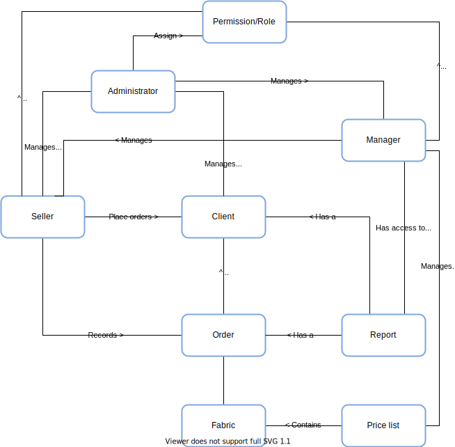

# Ninja Fabric Sale

**Conceptual map**

**Organizacao das classes**

-----

### Problemas no build

- O gradle só funcionou com a solução dada aqui: https://stackoverflow.com/questions/58282791/why-when-i-use-github-actions-ci-for-a-gradle-project-i-face-gradlew-permiss
